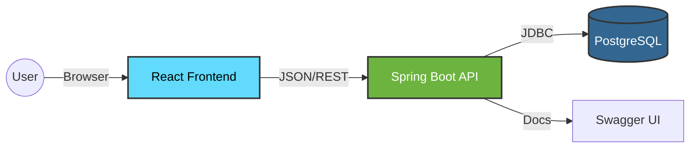

<div align="center">

# MarketTESTER

**Validate your business ideas before writing code.**

[](https://www.java.com/)
[](https://spring.io/projects/spring-boot)
[](https://reactjs.org/)
[](https://www.typescriptlang.org/)
[](https://www.postgresql.org/)
[](https://www.docker.com/)

[Request Demo](https://markettester.com) · [Report Bug](https://github.com/markettester/issues) · [Request Feature](https://github.com/markettester/issues)

</div>

---

## � About The Project

**MarketTESTER** is the ultimate B2B SaaS platform for entrepreneurs who want to stop guessing and start knowing. It provides a scientific framework to:
1.  **Define Hypotheses**: What needs to be true for your idea to work?
2.  **Run Experiments**: Interviews, Landing Pages, Ads.
3.  **Validate with Data**: Score your project's readiness based on real evidence.

> "Don't build it until you've sold it." — MarketTESTER Philosophy

---

## 🛠️ Tech Stack

We use the latest industry-standard technologies to ensure performance, scalability, and developer happiness.

| Component | Technology | Description |
| :--- | :--- | :--- |
| **Backend** |  **Spring Boot 3** | Robust REST API with secure stateless authentication (JWT). Data managed via JPA & Hibernate. |
| **Frontend** |  **Vite + TS** | Blazing fast Single Page Application (SPA). State validation via Zod & Zustand. |
| **Database** |  | Reliable relational data storage, versioned with **Flyway**. |
| **Docs** |  **OpenAPI 3** | Interactive API documentation auto-generated from code. |
| **Infra** |  | Full stack orchestration with a single command. |

---

## �️ Architecture

A clean separation of concerns ensures maintainability.



---

## ⚡ Getting Started

### 1️⃣ Clone & Infra
Start the database and backend services containerized.

```bash
git clone https://github.com/your-org/markettester.git
cd markettester/infra
docker-compose up -d
```

### 2️⃣ Backend (Local Dev)
If you want to debug the API source code:

```bash
cd ../backend
mvn spring-boot:run
```
_API runs on_ `http://localhost:8080/api`

### 3️⃣ Frontend (Local Dev)
Launch the UI with hot-reload.

```bash
cd ../frontend
npm install && npm run dev
```
_UI runs on_ `http://localhost:5173`

---

## � Contributing

Contributions are what make the open source community such an amazing place to learn, inspire, and create. Any contributions you make are **greatly appreciated**.

1.  Fork the Project
2.  Create your Feature Branch (`git checkout -b feature/AmazingFeature`)
3.  Commit your Changes
4.  Push to the Branch
5.  Open a Pull Request

---

<div align="center">
    <p>Built with ❤️ by the MarketTESTER Team</p>
</div>
